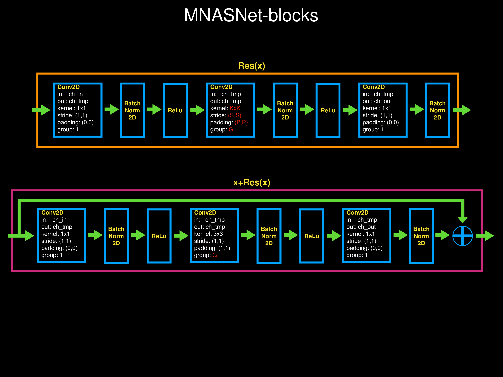

# Resnet / Wide_Resnet / Resnext / SE-Resnet / MNASnet
***
##### 之前做的整理
### Resnet18 / Resnet34

***
### Resnet50 / Resnet101 / Resnet152

***
### Wide_Resnet50 / Wide_Resnet101

***
### Resnext50 / Resnext101

***
### SE-Resnet50 / SE-Resnet101 / SE-Resnet152

***
### MNASnet

